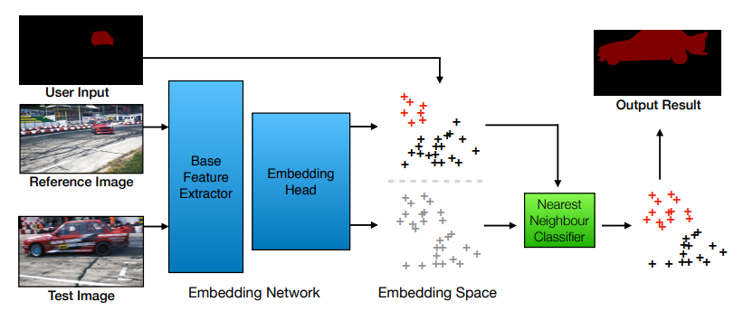

# Papyrus4Robotics Perception Components

## Video Object Tracking through Segmentation Embeddings

Inspired by the following embedding method: 

`Chen, Y., Pont-Tuset, J., Montes, A., & Van Gool, L. (2018). Blazingly fast video object segmentation with pixel-wise metric learning.`



---

### Usage

The basic structure of a command looks like:

```
python main.py --mode <mode> --custom_data <custom_data_directory> --seg_dir <ground_truth_segmentation_directory>
```

When no custom data is given, the DAVIS2016 dataset is used for either training or validation. Several choices for `mode` include:

- 'train': currently always trains on DAVIS2016 480p training dataset. No need for `custom_data` or `seg_dir` parameters.

- 'validation': by default takes DAVIS2016 480p validation data, but can be overwritten to use custom data images in `custom_data` with their corresponding ground truth segmentation masks in `seg_dir`. The ground truth is used to compute the Intersection over Union metric at the end.

- 'inference': At test time, no ground truth is known, hence `seg_dir` should be empty. Instead, a single annotated first frame should be given in the same directory as `custom_data` called "AnnotatedFrame.png".

In the command you can also specify `--batch_size` for multi-batch processing. In case a model has already been trained before, using `--load` will ... well, it will load the existing model.

You can use `--videos bear soapbox etc` to load certain videos from the dataset. These are then trained/validated separately.


## C++ Torch Script

The above **PyTorch** implementation of the model is trained on Python, but might need to be used in a C++ application for evaluation. This is possible through **LibTorch**, the conversion process will be described in the following.

### Conversion

In order to run **PyTorch** models in C++, we need to convert the model into a **Torch Script**. How we do it is through *Tracing*. This mechanism takes an example input, puts it through the PyTorch network and gathers gradients and network information in this manner.

> **Important note**: if you wish to evaluate the model on a CPU, you should be tracing the model on a CPU too.

The first step is to fully load your trained model `model`. Then create an example input with the correct shape (using a random values) `example`. Lastly run it through the network and store the traced model as follows:

```python
traced_script_module = torch.jit.trace(model, example)
traced_script_module.save("/some_dir/tracedModel.pt")
```

### Loading Torch Script in LibTorch

Now that we have the trained model as a traced script, we can load it in C++ using the **LibTorch** library. After installing the library, you can include the `<torch/script.h>` header and run:

```cpp
torch::jit::script::Module module = torch::jit::load(model_path);
```

A more detailed explanation can be found in <https://pytorch.org/tutorials/advanced/cpp_export.html>.


### Linux VM

Due to RAM constraints and CUDA not being directly available on the VM, we suggest running the model in C++ using eval mode and disabling gradient computation:

```cpp
module.eval();
{
    torch::NoGradGuard no_grad;
    at::Tensor output = module.forward(inputs).toTensor();
}
```

From experiments our model seems to use about 2GB of RAM on the VM in this manner, running on CPU.


### Papyrus Component

Using `colcon build` and then `ros2 run vos VOS` you can run the Papyrus component defined in the VOS directory. However, make sure to first change the paths in "VOS/src/VOSCompdef/VOS.cpp" for annotated\_path and model\_path. The first path should point to the image file that contains the annotated first frame for the video, and the second path should point to the traced model that you want to load.


